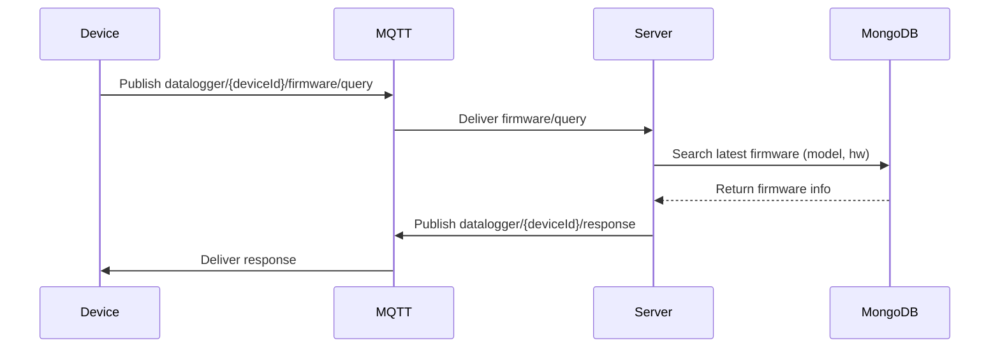
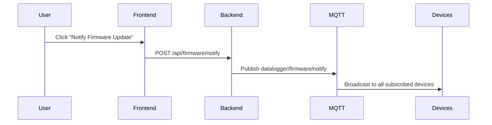
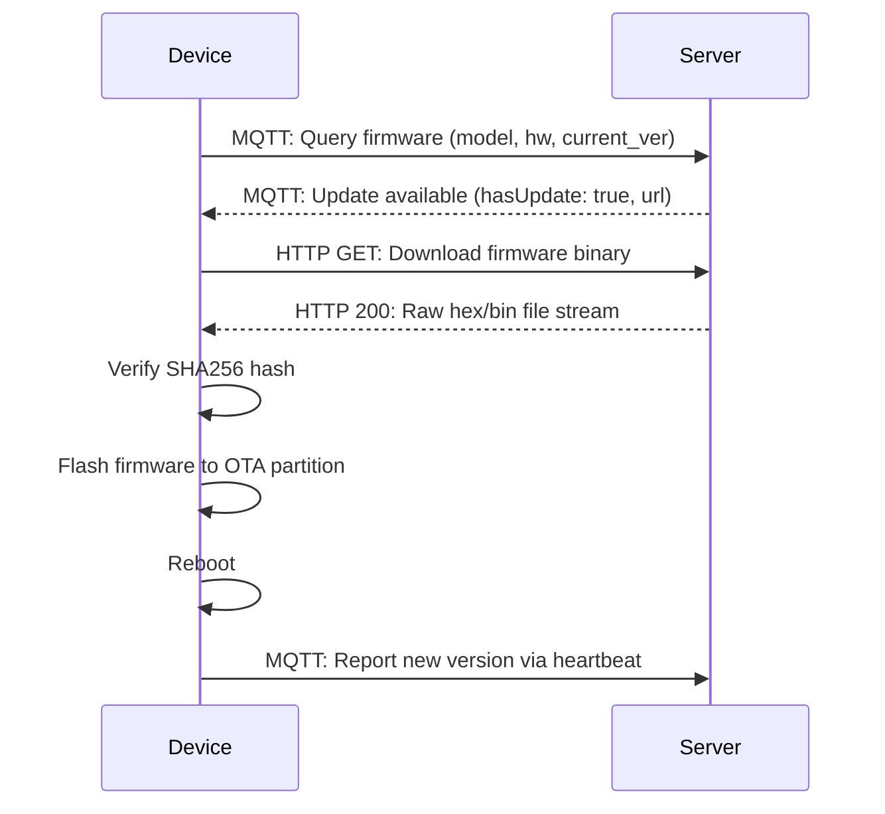

# Integration Guide

## 1. System Overview

The firmware management system is designed to provide robust Over-The-Air (OTA) updates and real-time monitoring for embedded devices. The architecture consists of several decoupled components communicating primarily through MQTT and REST APIs.

### Architecture Diagram

```text
       Device
         |
        MQTT
         |
  Firmware Server
         |
      MongoDB
         |
 Firmware Storage
```

### Component Responsibilities

* **Device:** The embedded edge node (e.g., datalogger). Responsible for connecting to the MQTT broker, publishing heartbeat and status messages, querying for firmware updates, downloading new binaries, verifying signatures, and flashing itself.
* **MQTT Broker:** The central messaging hub (e.g., EMQX or Mosquitto). Handles pub/sub routing between thousands of devices and the backend server.
* **Backend (Firmware Server):** A Node.js application that processes MQTT events, handles device registration, compares firmware versions, serves REST APIs for the dashboard, and manages firmware files.
* **MongoDB:** The database layer. Stores device registries, firmware metadata, MQTT logs, download logs, and user credentials.
* **Firmware Storage:** The file system (or cloud storage) where the actual compiled binary files (`.bin`, `.hex`) are stored securely.
* **Frontend Dashboard:** A React-based web interface for administrators to upload firmware, monitor online devices, view statistics, and manually trigger update notifications.

---

## 2. MQTT Communication Specification

The system uses a structured topic hierarchy under the `datalogger/` prefix.

### Heartbeat
**Topic:** `datalogger/{deviceId}/heartbeat`
* **Purpose:** Device heartbeat to indicate it is online.
* **Publisher:** Device
* **Subscriber:** Firmware Server
* **QoS recommendation:** QoS 1
* **Retain recommendation:** False
* **Payload schema:** JSON
* **Example payload:**
  ```json
  {
    "deviceId": "ABC123",
    "firmwareVersion": "5.0.0",
    "hardwareVersion": "1.0",
    "timestamp": "2026-06-24T08:00:00Z"
  }
  ```
* **Backend behavior:** Updates the `lastSeen` timestamp in the database and marks the device as `online`.

### Device Status
**Topic:** `datalogger/{deviceId}/status`
* **Purpose:** Periodic or event-driven device status report.
* **Publisher:** Device
* **Subscriber:** Firmware Server
* **QoS recommendation:** QoS 1
* **Retain recommendation:** False
* **Payload schema:** JSON
* **Example payload:**
  ```json
  {
    "deviceId": "ABC123",
    "temperature": 42.5,
    "freeMemory": 123456,
    "uptime": 86400
  }
  ```
* **Backend behavior:** Stores the status log, updates the device record, and pushes real-time updates to the web dashboard via Socket.IO.

### Firmware Query
**Topic:** `datalogger/{deviceId}/firmware/query`
* **Purpose:** Check whether a newer firmware version exists for the specific hardware.
* **Publisher:** Device
* **Subscriber:** Firmware Server
* **QoS recommendation:** QoS 1
* **Retain recommendation:** False
* **Payload schema:** JSON
* **Example payload:**
  ```json
  {
    "deviceId": "ABC123",
    "deviceModel": "Relay64x2",
    "hardwareVersion": "1.0",
    "currentFirmware": "5.0.0"
  }
  ```
* **Backend behavior:** Parses the query, searches MongoDB for the latest firmware matching `deviceModel` and `hardwareVersion`, compares it to `currentFirmware`, and generates an update response.

### Firmware Response
**Topic:** `datalogger/{deviceId}/response`
* **Purpose:** Firmware update response sent specifically to the querying device.
* **Publisher:** Firmware Server
* **Subscriber:** Device
* **QoS recommendation:** QoS 1
* **Retain recommendation:** False
* **Payload schema:** JSON
* **Example payload:**
  ```json
  {
    "hasUpdate": true,
    "latestVersion": "5.1.0",
    "downloadUrl": "http://server/api/firmware/download?deviceModel=Relay64x2&hw=1.0&version=latest"
  }
  ```
* **Fields Explanation:**
  * `hasUpdate`: Boolean indicating if a newer version is available.
  * `latestVersion`: The version string of the new firmware (if `hasUpdate` is true).
  * `downloadUrl`: The REST HTTP endpoint where the device can download the actual binary file.

### Firmware Notification
**Topic:** `datalogger/firmware/notify`
* **Purpose:** Broadcast a global or group notification that a new firmware update has been released.
* **Publisher:** Firmware Server
* **Subscriber:** All devices
* **QoS recommendation:** QoS 1
* **Retain recommendation:** False
* **Payload schema:** JSON
* **Example payload:**
  ```json
  {
    "action": "notify",
    "firmwareVersion": "5.1.0",
    "timestamp": "2026-06-24T08:00:00Z"
  }
  ```
* **Backend trigger:** Executed when an administrator clicks "Notify Firmware Update" on the web dashboard.
* **Device behavior:** Upon receiving this broadcast, the device should initiate a standard firmware query to check if the notification applies to its specific hardware variant.

---

## 3. MQTT Sequence Diagrams

### Firmware Query Flow



**Step Explanation:**
1. The Device publishes its current state and hardware information to the query topic.
2. The MQTT Broker routes this to the subscribed Firmware Server.
3. The Server queries the MongoDB database for the latest firmware matching the device's hardware model.
4. The database returns the latest firmware metadata.
5. The Server evaluates if an update is needed and publishes a JSON response to the device's unique response topic.
6. The MQTT Broker delivers the response to the listening Device.

### Firmware Notification Flow



**Step Explanation:**
1. The administrator clicks the notification button in the web dashboard.
2. The Frontend sends an authenticated REST API POST request to the Backend.
3. The Backend constructs the notification payload and publishes it to the broadcast topic.
4. The MQTT Broker broadcasts the message to all devices currently subscribed to the notification topic.

---

## 4. REST API Specification

### Login API
* **URL:** `/api/auth/login`
* **Method:** `POST`
* **Authentication requirement:** None
* **Request body:**
  ```json
  {
    "username": "admin",
    "password": "admin123"
  }
  ```
* **Success response:** `200 OK`
  ```json
  {
    "success": true,
    "accessToken": "ey...",
    "refreshToken": "ey...",
    "user": {
      "id": "123",
      "username": "admin",
      "role": "admin"
    }
  }
  ```
* **Error response:** `401 Unauthorized`
  ```json
  {
    "success": false,
    "message": "Invalid credentials"
  }
  ```
* **Example curl:**
  ```bash
  curl -X POST http://localhost:80/api/auth/login \
       -H "Content-Type: application/json" \
       -d '{"username":"admin","password":"admin123"}'
  ```

### Upload Firmware API
* **URL:** `/api/firmware/upload`
* **Method:** `POST`
* **Authentication requirement:** Bearer Token (Admin)
* **Request type:** `multipart/form-data`
* **Explanation:** Used by the dashboard to upload new firmware binaries. The request must contain the binary file and metadata fields as form data.
* **Form fields:**
  * `file`: The firmware binary (`.bin` or `.hex`)
  * `projectName`: String
  * `deviceModel`: String
  * `hardwareVersion`: String
  * `firmwareVersion`: String
  * `description`: String
* **Success response:** `201 Created`
* **Example curl:**
  ```bash
  curl -X POST http://localhost:80/api/firmware/upload \
       -H "Authorization: Bearer <token>" \
       -F "file=@/path/to/firmware.bin" \
       -F "projectName=SmartLogger" \
       -F "deviceModel=Relay64x2" \
       -F "hardwareVersion=1.0" \
       -F "firmwareVersion=5.1.0" \
       -F "description=Critical security patch"
  ```

### Download Firmware API
* **URL:** `/api/firmware/download`
* **Method:** `GET`
* **Authentication requirement:** None (for devices)
* **Query parameters:**
  * Either `id`: The MongoDB ObjectId of the firmware.
  * OR `deviceModel`, `hw` (hardwareVersion), and `version` (can be "latest" or a specific version string).
* **Explanation:** Returns the raw binary file as an attachment. Used by devices to download the actual firmware.
* **Examples:**
  ```http
  GET /api/firmware/download?deviceModel=Relay64x2&hw=1.0&version=latest
  GET /api/firmware/download?id=60d5ecb8b392d7001f34f8a1
  ```

### Latest Firmware API
* **URL:** `/api/firmware/latest`
* **Method:** `GET`
* **Authentication requirement:** None
* **Query parameters:** `deviceModel`, `hardwareVersion`, `currentVersion`
* **Explanation:** Evaluates if a newer version exists using semantic versioning comparison.
* **Example request:**
  ```http
  GET /api/firmware/latest?deviceModel=Relay64x2&hardwareVersion=1.0&currentVersion=5.0.0
  ```
* **Example response:**
  ```json
  {
    "success": true,
    "hasUpdate": true,
    "latestVersion": "5.1.0",
    "firmware": {
      "id": "123",
      "size": 1048576,
      "hash": "a1b2c3d4..."
    }
  }
  ```

---

## 5. Device Integration Guide

For embedded devices, the integration process should strictly follow the recommended startup and update sequence to ensure stability and avoid bricking.

### Startup Sequence
1. **Connect MQTT:** Establish TLS/TCP connection to the EMQX/Mosquitto broker.
2. **Subscribe:** Subscribe to `datalogger/{deviceId}/response` and `datalogger/firmware/notify`.
3. **Send Heartbeat:** Publish initial device details to `datalogger/{deviceId}/heartbeat`.
4. **Check Firmware Version:** Publish to `datalogger/{deviceId}/firmware/query`.
5. **Evaluate Response:** Listen on the response topic. If `hasUpdate` is true, proceed to download.
6. **Download Firmware:** Perform an HTTP GET request to the provided `downloadUrl`. Stream the binary into flash memory (OTA partition).
7. **Verify Hash:** Compute the SHA256 hash of the downloaded firmware and compare it to the expected hash.
8. **Flash & Swap:** Mark the new OTA partition as active.
9. **Reboot:** Restart the microcontroller.
10. **Report New Version:** Upon restart, the initial heartbeat will contain the new version, confirming the successful update to the server.

### Pseudocode Example

```c
void on_network_connect() {
    mqtt_connect("broker.emqx.io", 1883);
    mqtt_subscribe("datalogger/ABC123/response", QOS1);
    mqtt_subscribe("datalogger/firmware/notify", QOS1);
    
    char* heartbeat = "{\"deviceId\":\"ABC123\",\"firmwareVersion\":\"5.0.0\",\"hardwareVersion\":\"1.0\"}";
    mqtt_publish("datalogger/ABC123/heartbeat", heartbeat, QOS1);
    
    char* query = "{\"deviceId\":\"ABC123\",\"deviceModel\":\"Relay64x2\",\"hardwareVersion\":\"1.0\",\"currentFirmware\":\"5.0.0\"}";
    mqtt_publish("datalogger/ABC123/firmware/query", query, QOS1);
}

void on_mqtt_message(char* topic, char* payload) {
    if (strcmp(topic, "datalogger/ABC123/response") == 0) {
        JsonResponse res = parse_json(payload);
        if (res.hasUpdate) {
            start_ota_download(res.downloadUrl);
        }
    }
}

void start_ota_download(char* url) {
    http_client_get(url, file_buffer);
    if (verify_sha256(file_buffer, expected_hash)) {
        flash_ota_partition(file_buffer);
        system_reboot();
    }
}
```

---

## 6. Firmware Update Flow



**Stage Explanation:**
* **Query & Response:** Uses lightweight MQTT to rapidly determine if a heavy HTTP download is necessary.
* **Download:** Uses standard HTTP GET for the large binary transfer, enabling resumable downloads if supported by the device.
* **Verification & Flashing:** Strictly local to the device to ensure memory integrity.
* **Confirmation:** The server only considers the update "successful" when it receives a subsequent heartbeat running the new version.

---

## 7. Error Handling

Firmware processes are vulnerable to network and memory disruptions. Implement these safeguards:

* **MQTT Disconnected:** Use an exponential backoff retry strategy for MQTT reconnection. Do not continuously spam the broker.
* **Invalid Firmware / Download Timeout:** If the HTTP download fails or times out, abort the OTA process, delete the partial buffer, and wait 1 hour before querying again.
* **SHA256 Mismatch:** If the downloaded file's hash does not perfectly match the expected hash, **DO NOT FLASH**. Discard the file and report an error via a status payload.
* **Flash Failure:** Use a dual-bank (A/B) OTA partition layout. If flashing bank B fails or the device bootloops, the bootloader should automatically revert to bank A.

---

## 8. Security Recommendations

* **JWT Authentication:** Ensure all REST API calls from the dashboard are authenticated via expiring JWTs.
* **HTTPS Usage:** Always serve the REST API and the dashboard over HTTPS. Firmware binaries should be downloaded via HTTPS to prevent Man-In-The-Middle (MITM) tampering.
* **MQTT Authentication:** Secure the MQTT broker using Client IDs, usernames, and passwords. Disable anonymous connections. Use MQTTS (port 8883) if the device hardware supports TLS.
* **Firmware Signing:** Beyond SHA256 hashing, consider cryptographically signing your `.bin` files using an ECDSA private key. The bootloader should verify the public key signature before booting.
* **Rate Limiting:** Implement rate limiters on the Node.js backend to prevent denial-of-service attacks on the firmware download endpoints.

---

## 9. Troubleshooting

### Device not receiving MQTT response
* **Diagnosis:** Check if the device is correctly subscribed to `datalogger/{deviceId}/response`. Verify that the `{deviceId}` matches exactly (case-sensitive) with the ID used by the backend.
* **Fix:** Inspect EMQX dashboard to verify device subscriptions.

### Firmware not found (No Update Triggered)
* **Diagnosis:** The server checks `deviceModel` and `hardwareVersion` exactly. If the device sends `"Relay64X2"` and the database has `"Relay64x2"`, it will not match.
* **Fix:** Ensure string casing matches exactly between device firmware code and the backend uploads.

### MQTT broker disconnected
* **Diagnosis:** The Node.js backend throws `ENOTFOUND broker.emqx.io` or `ECONNREFUSED`.
* **Fix:** Check server outbound internet access and DNS resolution. Ensure the `.env` file contains the correct `MQTT_BROKER_URL`.

### Download API returns 404
* **Diagnosis:** The firmware file was deleted from the disk but remains in MongoDB, or the URL is malformed.
* **Fix:** Re-upload the firmware via the Dashboard. Ensure the `storagePath` physically exists in the `uploads/` directory on the backend server.
